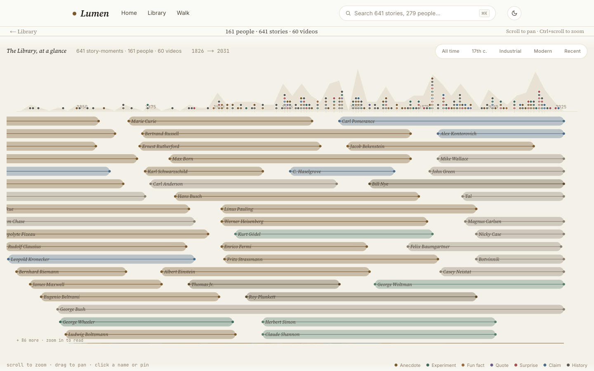

# Lumen

**Turn science YouTube videos into an explorable knowledge graph.**

Lumen ingests science channels, extracts the people, discoveries, and ideas mentioned in each video with an LLM pipeline, links them against Wikipedia / Wikidata / OpenAlex, and serves the result as an interactive web app — a zoomable timeline of scientific stories you can walk through entity by entity.



## How it works

```
YouTube channel/URL
      │  yt-dlp + youtube-transcript-api
      ▼
 transcripts ──► LLM extraction ──► entity resolution ──► enrichment ──► embeddings
                 (parallel Claude      (merge duplicate     (Wikipedia,     (sentence-
                  subagents via         people/topics)       Wikidata,       transformers +
                  /process command)                          OpenAlex)       sqlite-vec)
                                                                                │
                                                                                ▼
                                                            SQLite ──► Next.js web app
```

1. **Ingest** — `ingest_channel.py` / `ingest_url.py` pull video metadata, `fetch_transcript.py` grabs transcripts.
2. **Extract** — a work queue (`extract_prep.py`) feeds parallel Claude subagents that pull structured entities (people, discoveries, events, topics) out of each transcript; results are schema-validated and written back (`extract_write.py`).
3. **Resolve & merge** — `resolve_entities.py` / `merge_entities.py` deduplicate entities across videos.
4. **Enrich** — cross-reference entities with Wikipedia, Wikidata, and OpenAlex for canonical IDs, dates, occupations, and citations.
5. **Embed & index** — sentence-transformers embeddings stored in sqlite-vec; `build_edges.py` / `build_index.py` produce the graph.
6. **Explore** — Next.js 15 + React 19 + D3 app: zoomable timeline, story cards, per-person/topic/video pages, and a "walk" mode that hops the graph.

Everything lands in a single SQLite file — no services to run, the whole library is portable.

## Stack

- **Pipeline** — Python 3.12, uv, pydantic + jsonschema validation, sqlite-vec, sentence-transformers
- **Extraction** — Claude subagents orchestrated through Claude Code slash commands (`.claude/commands/`)
- **Web** — Next.js 15, React 19, TypeScript, Tailwind, D3 (zoom/scale), better-sqlite3
- **Quality** — mypy `strict`, ruff, pytest

## Quickstart

```bash
# Pipeline
uv sync
uv run python -m scripts.lib.db init          # creates data/library.db
uv run python -m scripts.ingest_channel @<channel>
uv run python -m scripts.fetch_transcript

# Web app
cd web
pnpm install
pnpm dev
```

Extraction runs inside [Claude Code](https://claude.com/claude-code) via the `/process` command, which batches pending videos and dispatches parallel extractor subagents.

## Layout

```
scripts/        pipeline stages (ingest → extract → resolve → enrich → embed → index)
scripts/lib/    db, schema, validation, http cache, wikidata client
prompts/        extraction prompt + few-shot examples
.claude/        extractor agent + pipeline slash commands
web/            Next.js app (timeline, story, person, topic, video, walk views)
data/           SQLite library (generated, not tracked)
```
